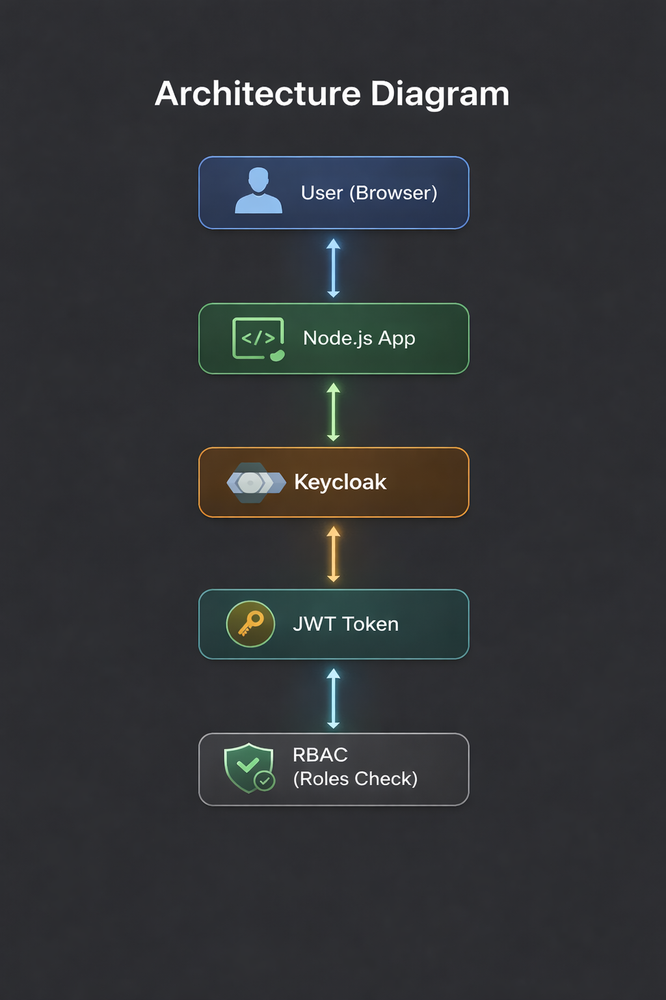

### **IAM Keycloak RBAC System (Node.js + OpenID Connect)**

**Overview**

This project is a Identity and Access Management (IAM) implementation built using:

* Keycloak (Identity Provider)
* Node.js + Express (Relying Party / Application)
* OpenID Connect (Authentication protocol)
* JWT (Authorization mechanism)
* Role-Based Access Control (RBAC)

It simulates enterprise-level authentication and authorization workflows used in modern organizations.

\---

**Features**

1. Single Sign-On (SSO) with Keycloak
2. User authentication via OpenID Connect
3. JWT token decoding and inspection
4. Role-Based Access Control (RBAC)
5. Secure session management using express-session
6. User profile extraction (name, email, username)
7. Secure logout with Keycloak integration
8. Protected routes (`/secure`, `/admin`)
9. Token debugging endpoint (`/token`)

\---

System Architecture

User → Node.js App → Keycloak → JWT Token → Role Validation → Access Control

\---

IAM Concepts Demonstrated

1. Authentication vs Authorization
2. Identity Provider (Keycloak)
3. Service Provider (Node.js application)
4. OpenID Connect (OIDC)
5. JWT (JSON Web Tokens)
6. Claims-based identity
7. Role-Based Access Control (RBAC)
8. Session management

\---

**Roles Configuration**

Supported Roles:

1. `admin` → Full access (Admin dashboard)
2. `user` → Limited access (Secure dashboard)

\---

**Keycloak Setup Instructions**

* Install dependencies

&#x20;"npm install"

* Start Keycloak server. Ensure Keycloak is running locally:

&#x20;"http://localhost:8080"

3\. Configure Keycloak (FULL SETUP - REPRODUCIBLE IAM CONFIG)

Follow this exact configuration to reproduce the same IAM system:

* Realm Setup

Realm Name: Company-Realm

Enable Realm: ON (default)

* Users

Create the following users:

Username: john001

Email: any valid email

password: set temporary password → disable “Temporary” after first login

Role: user

Username: admin001

Email: any valid email

Password: set temporary password → disable “Temporary” after first login

Role: admin

* Realm Roles

Create these roles:

user

admin

* Role Mapping (VERY IMPORTANT)

Go to each user → Role Mapping:

john001 → assign user

admin001 → assign admin

Also ensure roles are assigned under:

Realm Roles → Available Roles → Assigned Roles

* Client Setup

Create client:

Client ID: node-app

Client Type: Confidential

Client Authentication: ON

Standard Flow (Authorization Code Flow): ON

Direct Access Grants: OFF

* Valid Redirect URIs

Add:

http://localhost:3000/callback

* Web Origins

Set:

http://localhost:3000

* Credentials

Go to: Client → Credentials

Copy Client Secret

Paste into Node.js app (client\_secret)

* Client Scopes (CRITICAL FOR JWT CLAIMS)

Go to: Client → node-app → Client Scopes

Ensure these are assigned:

Default Client Scopes:

openid

profile

email

Optional (Recommended):

roles

* Mappers (ENSURE ROLES APPEAR IN TOKEN)

Go to: Client → node-app → Client Scopes → Mappers

Add/Verify:

Mapper Type: User Realm Role

Token Claim Name: realm\_access.roles

Add to ID token: ON

Add to Access token: ON

Add to UserInfo: ON

* Token Verification

After login, decoded JWT should include:

"realm\_access": {

&#x20; "roles": \["admin", "user"]

}

OR

"resource\_access": {

&#x20; "node-app": {

&#x20;   "roles": \["admin"]

&#x20; }

}

4\. Start Node.js Application Start Node.js Application

node app.js

**Authentication Flow**

1. User clicks login
2. Redirected to Keycloak login page
3. User authenticates
4. Keycloak issues JWT token
5. Node.js validates token
6. Roles are extracted
7. Access granted or denied based on RBAC

| Route       | Description          |

| ----------- | -------------------- |

| `/`         | Home page            |

| `/login`    | Redirect to Keycloak |

| `/callback` | OAuth callback       |

| `/secure`   | User dashboard       |

| `/admin`    | Admin-only dashboard |

| `/token`    | JWT inspection tool  |

| `/logout`   | Logout from system   |

**Security Features**

1. Secure session management
2. JWT-based authentication
3. Role filtering (RBAC)
4. Protected admin routes
5. Keycloak logout integration
6. Token inspection for debugging

**Author**

Cybersecurity Student

Focus Areas:

Identity \& Access Management (IAM)

Red Teaming

Security Engineering

<h2 align="center"> IAM Architecture</h2>

  

